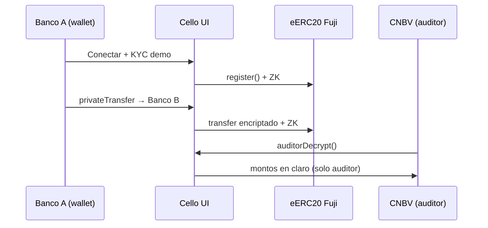

# Documentación Cello — índice para el equipo

Este monorepo une **frontend** (Cello UI + eERC SDK) y **avalanche-back** (contratos). Para la hackathon el producto corre sobre **EncryptedERC (eERC20)** en Fuji, no sobre InterbankVault.

## Por dónde empezar

| Rol | Leer primero | Luego |
|-----|--------------|-------|
| **Frontend** | [frontend/docs/DEPLOY.md](../frontend/docs/DEPLOY.md) | [frontend/docs/ENV.md](../frontend/docs/ENV.md) |
| **Contratos / back** | [avalanche-back/docs/DEPLOY-EERC.md](../avalanche-back/docs/DEPLOY-EERC.md) | [EncryptedERC (Ava Labs)](https://github.com/ava-labs/EncryptedERC) |
| **Demo / pitch** | [DEMO.md](./DEMO.md) | [DEPLOY.md](./DEPLOY.md) (checklist coordinado) |
| **DevOps** | [DEPLOY.md](./DEPLOY.md) | `GET /api/health` en el front desplegado |

## Flujo end-to-end (resumen)



## Estructura del repo

```
avax-compliance/
├── docs/                 ← este índice, DEMO, DEPLOY coordinado
├── frontend/             ← Next.js + @avalabs/eerc-sdk
│   ├── docs/             ← deploy y variables del front
│   └── public/circuits/  ← WASM/ZK (npm run circuits:fetch)
└── avalanche-back/       ← Foundry (legacy InterbankVault + guía eERC)
    └── docs/             ← deploy contratos
```

## Handoff: qué necesita el front del back

Cuando el equipo de contratos termine el deploy, pasar al front:

1. `NEXT_PUBLIC_EERC_CONTRACT_ADDRESS` — dirección del **EncryptedERC** en Fuji
2. `NEXT_PUBLIC_EERC_MODE` — `standalone` o `converter`
3. Si es converter: `NEXT_PUBLIC_CONVERTER_ERC20_ADDRESS`
4. `NEXT_PUBLIC_INDEXER_FROM_BLOCK` — bloque del deploy (para indexer futuro)
5. Direcciones `0x` de wallets demo ya **registradas** en el contrato (Bankaool, FinNova, etc.)
6. Wallet **auditor** configurada con `setContractAuditorPublicKey` (solo owner del contrato)

## Handoff: qué necesita el back del front

- Ningún secreto de auditor en variables `NEXT_PUBLIC_*` en producción
- La UI asume Fuji (`chainId` 43113) y circuitos en `/circuits/*`
- Health check: `https://<tu-deploy>/api/health`

## Enlaces útiles

- [eERC SDK](https://docs.avacloud.io/encrypted-erc/usage/sdk-overview)
- [useEERC / auditorDecrypt](https://docs.avacloud.io/encrypted-erc/usage/useEERC)
- [Faucet Fuji](https://faucet.avax.network/)
- [Snowtrace Fuji](https://testnet.snowtrace.io/)
